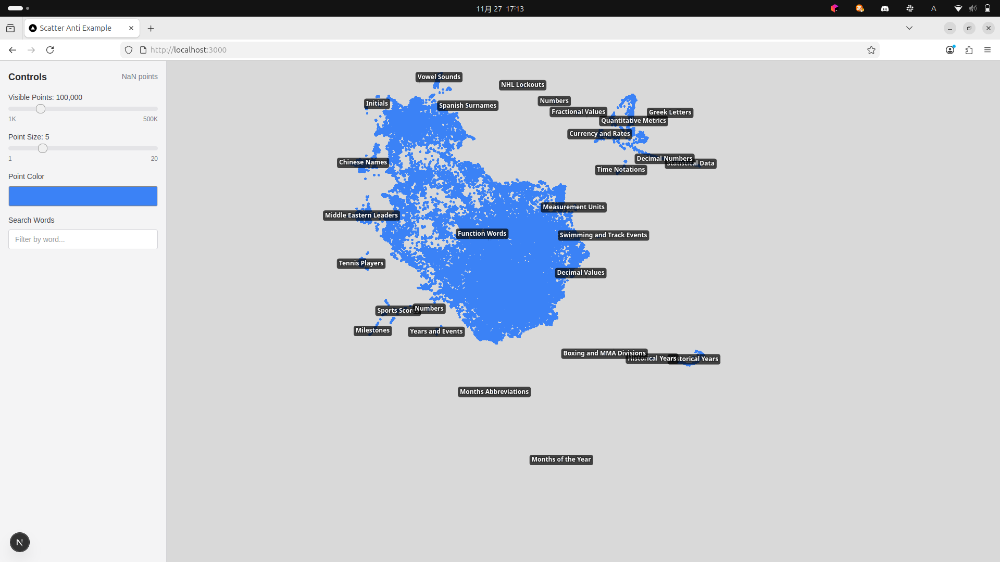

# scatter-anti

[](https://github.com/UoA-CSS-Lab/scatter-anti/blob/main/LICENSE)
[](https://www.npmjs.com/package/scatter-anti)
[](https://github.com/UoA-CSS-Lab/scatter-anti/actions/workflows/ci.yaml)
[](https://deepwiki.com/UoA-CSS-Lab/scatter-anti)

> scatter-antiは大規模な散布図を描画するための、TypeScriptライブラリです。

従来の散布図描画ライブラリでは、全文検索などの複雑なフィルタリングに時間がかかりました。scatter-antiは、DuckDB-WASMによるSQL内での高速なデータ処理と、WebGPUによる大規模並列レンダリングを組み合わせることで、数十万点規模のデータでもスムーズな操作を実現します。

* **WebGPUによるレンダリング:** GPUの能力を活用し、ブラウザ上で大規模な散布図を高速に描画します。CanvasやSVGでは扱えきれないような大量のデータポイントであっても、スムーズな操作を実現します。

* **DuckDB-WASMによる高速なデータ分析:** DuckDB-WASMを内蔵しており、標準的なSQLを実行できます。SQLを使って動的に描画データをフィルタリングしたり、点の色やサイズを計算したりすることが可能です。

* **ラベル表示:** データポイントにテキストラベルを表示できます。クラスタリングの結果を可視化する際に、各クラスタの中心や代表点にラベルを表示したり、特定のデータポイントに注釈を付けたりするのに最適です。

## 画面イメージ



## データについて

### Parquetファイル

scatter-antiは、Parquet形式のデータファイルを読み込みます。以下のカラムが必要です:

| カラム | 型 | 説明 |
|--------|------|------|
| `x` | double | X座標 |
| `y` | double | Y座標 |
| IDカラム | 任意 | ポイントを識別するための一意キー（カラム名は`idColumn`オプションで指定） |

その他のカラムはSQLで参照でき、色やサイズの計算に利用できます。

### GeoJSONファイル（ラベル用）

ラベルを表示するには、GeoJSON形式のファイルを指定します:

```json
{
  "type": "FeatureCollection",
  "features": [
    {
      "type": "Feature",
      "geometry": {
        "type": "Point",
        "coordinates": [x, y]
      },
      "properties": {
        "cluster_label": "ラベルテキスト"
      }
    }
  ]
}
```

## API

```typescript
const plot = new ScatterPlot({
  canvas: HTMLCanvasElement,  // 描画先のcanvas要素
  dataUrl: string,            // ParquetファイルのURL
  data: {
    idColumn: string,                    // IDカラム名（必須）
    visiblePointLimit?: number,          // 描画最大ポイント数（デフォルト: 100,000）
    sizeSql?: string,                    // サイズ計算SQL式（デフォルト: "3"）
    colorSql?: string,                   // 色計算SQL式（ARGB 32bit整数、デフォルト: "0x4D4D4DCC"）
    whereConditions?: WhereCondition[],  // フィルタ条件
  },
  gpu?: {
    backgroundColor?: ColorRGBA,  // 背景色
  },
  labels?: {
    url?: string,                        // GeoJSONファイルのURL
    fontSize?: number,                   // フォントサイズ（デフォルト: 12）
    filterLambda?: LabelFilterLambda,    // ラベル表示フィルタ
    onClick?: (label: Label) => void,    // クリックコールバック
  },
  interaction?: {
    onPointHover?: PointHoverCallback,   // ポイントホバーコールバック
  },
});

await plot.initialize();
```

主要メソッド:

* `render()`: 描画
* `setZoom(zoom)` / `zoomIn()` / `zoomOut()`: ズーム操作
* `setPan(x, y)` / `getPan()`: パン操作
* `resetView()`: ビューリセット
* `update(options)`: オプション更新
* `runQuery(sql)`: カスタムSQLクエリ実行
* `destroy()`: リソース解放

## Examples

### 実行方法

```bash
# ライブラリのビルド（ルートディレクトリで）
npm install
npm run build

# サンプルアプリの実行
cd examples/next
npm install
npm run dev
```

ブラウザで http://localhost:3000 を開きます。

### サンプルデータ

サンプルでは、GloVe 6B単語ベクトルをUMAPで2次元に投影したデータを使用しています（約40万単語）。

* データセット: https://huggingface.co/datasets/mt0rm0/glove.6B.50d.umap.2d

### ラベル生成

ラベルはDBSCANクラスタリングとOpenAI APIを使って生成できます:

```bash
cd examples/next
export OPENAI_API_KEY="your-api-key"
python scripts/generate_labels.py
```

## ライセンス

このライブラリは [MIT License](./LICENSE) の下でライセンスされています。
