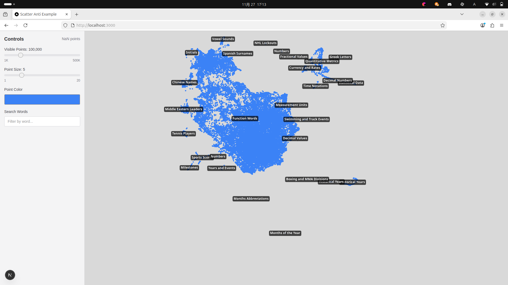

# duckscatter

[](https://github.com/UoA-CSS-Lab/duckscatter/blob/main/LICENSE)
[](https://www.npmjs.com/package/@uoa-css-lab/duckscatter)
[](https://github.com/UoA-CSS-Lab/duckscatter/actions/workflows/ci.yaml)
[](https://deepwiki.com/UoA-CSS-Lab/duckscatter)

> duckscatterは大規模な散布図を描画するための、TypeScriptライブラリです。

従来の散布図描画ライブラリでは、全文検索などの複雑なフィルタリングに時間がかかりました。duckscatterは、DuckDB-WASMによるSQL内での高速なデータ処理と、WebGPUによる大規模並列レンダリングを組み合わせることで、数十万点規模のデータでもスムーズな操作を実現します。

* **WebGPUによるレンダリング:** GPUの能力を活用し、ブラウザ上で大規模な散布図を高速に描画します。CanvasやSVGでは扱えきれないような大量のデータポイントであっても、スムーズな操作を実現します。

* **DuckDB-WASMによる高速なデータ分析:** DuckDB-WASMを内蔵しており、標準的なSQLを実行できます。SQLを使って動的に描画データをフィルタリングしたり、点の色やサイズを計算したりすることが可能です。

* **ラベル表示:** データポイントにテキストラベルを表示できます。クラスタリングの結果を可視化する際に、各クラスタの中心や代表点にラベルを表示したり、特定のデータポイントに注釈を付けたりするのに最適です。

## 画面イメージ



## データについて

### Parquetファイル

duckscatterは、Parquet形式のデータファイルを読み込みます。以下のカラムが必要です:

| カラム | 型 | 説明 |
|--------|------|------|
| `x` | double | X座標 |
| `y` | double | Y座標 |

その他のカラムはSQLで参照でき、色やサイズの計算に利用できます。

### GeoJSONファイル（ラベル用）

ラベルを表示するには、GeoJSON形式のファイルを指定します:

```json
{
  "type": "FeatureCollection",
  "features": [
    {
      "type": "Feature",
      "geometry": {
        "type": "Point",
        "coordinates": [x, y]
      },
      "properties": {
        "cluster_label": "ラベルテキスト"
      }
    }
  ]
}
```

## API

```typescript
const plot = new ScatterPlot({
  canvas: HTMLCanvasElement,  // 描画先のcanvas要素
  dataUrl: string,            // ParquetファイルのURL
  data: {
    visiblePointLimit?: number,               // 描画最大ポイント数（デフォルト: 100,000）
    sizeSql?: string,                         // サイズ計算SQL式（デフォルト: "3"）
    colorSql?: string,                        // 色計算SQL式（ARGB 32bit整数、デフォルト: "0x4D4D4DCC"）
    whereConditions?: WhereCondition[],       // フィルタ条件（CPU側）
    gpuFilterColumns?: string[],              // GPUフィルタリング用カラム名（最大4つ）
    gpuWhereConditions?: GpuWhereCondition[], // GPUフィルター条件
  },
  gpu?: {
    backgroundColor?: Color4f,  // 背景色
    pointAlpha?: number,          // グローバル透明度（0.0-1.0、デフォルト: 1.0）
    pointSizeScale?: number,      // グローバルサイズスケール（デフォルト: 1.0）
  },
  labels?: {
    url?: string,                             // GeoJSONファイルのURL
    fontSize?: number,                        // フォントサイズ（デフォルト: 12）
    filterLambda?: LabelFilterLambda,         // ラベル表示フィルタ
    onClick?: (label: Label) => void,         // クリックコールバック
    hoverOutlineOptions?: HoverOutlineOptions, // ホバーアウトライン設定
  },
  interaction?: {
    onPointHover?: PointHoverCallback,   // ポイントホバーコールバック
    onLabelHover?: LabelHoverCallback,   // ラベルホバーコールバック
  },
});

await plot.initialize();
```

主要メソッド:

* `render()`: 描画
* `resize(width, height)`: キャンバスリサイズ
* `setZoom(zoom)` / `getZoom()` / `zoomIn()` / `zoomOut()`: ズーム操作
* `zoomToPoint(newZoom, screenX, screenY)`: 指定座標を中心にズーム
* `setPan(x, y)` / `getPan()` / `pan(dx, dy)`: パン操作
* `resetView()`: ビューリセット
* `update(options)`: オプション更新
* `runQuery(sql)`: カスタムSQLクエリ実行
* `getLabels()`: ラベル全件取得
* `destroy()`: リソース解放

**ポイント表示属性制御:**

* `setPointAlpha(alpha)`: グローバル透明度を設定（0.0-1.0）
* `getPointAlpha()`: 現在のグローバル透明度を取得
* `setPointSizeScale(scale)`: グローバルサイズスケールを設定
* `getPointSizeScale()`: 現在のグローバルサイズスケールを取得

**ホバー制御API:**

外部コンポーネントからプログラム的にホバー状態を制御できます。

* `setPointHover(pointId)`: ポイントをホバー状態に（`Promise<boolean>`）
* `clearPointHover()`: ポイントホバー解除
* `getHoveredPoint()`: ホバー中のポイント取得
* `setLabelHover(identifier)`: ラベルをホバー状態に（`boolean`を返す）
* `clearLabelHover()`: ラベルホバー解除
* `getHoveredLabel()`: ホバー中のラベル取得
* `clearAllHover()`: 全ホバー解除

```typescript
// 使用例
await plot.setPointHover(12345);           // rowidでポイントをホバー
plot.setLabelHover({ text: 'Cluster A' }); // テキストでラベルをホバー
plot.setLabelHover({ cluster: 5 });        // クラスタ番号でラベルをホバー
plot.clearAllHover();                      // 全ホバー解除
```

## GPUフィルタリング

GPUフィルタリングを使用すると、数値カラムの範囲フィルタをGPU側で高速に実行できます。データの再フェッチなしにリアルタイムでフィルタリングが可能です。

```typescript
const plot = new ScatterPlot({
  // ...
  data: {
    // GPUフィルタリング用のカラムを指定（最大4つ）
    gpuFilterColumns: ['frequency', 'length'],
    // フィルター条件を指定
    gpuWhereConditions: [
      { column: 'frequency', min: 100, max: 10000 },
      { column: 'length', min: 3 },
    ],
  },
});

// 実行時にフィルター条件を更新
await plot.update({
  data: {
    gpuWhereConditions: [
      { column: 'frequency', min: 500 },
    ],
  },
});
```

**CPUフィルタ（`whereConditions`）との違い:**

| | CPUフィルタ | GPUフィルタ |
|---|---|---|
| **対応演算子** | 数値比較、文字列検索、生SQL | 範囲のみ（min/max） |
| **更新速度** | SQLクエリ再実行が必要 | 即座に反映 |
| **用途** | 複雑な条件、全文検索 | スライダーなどリアルタイム操作 |

## 型定義

主な型定義:

```typescript
// GPUフィルター条件
interface GpuWhereCondition {
  column: string;  // gpuFilterColumnsで指定したカラム名
  min?: number;    // 最小値（省略時: -Infinity）
  max?: number;    // 最大値（省略時: +Infinity）
}

// ホバーアウトラインオプション
interface HoverOutlineOptions {
  enabled?: boolean;           // 有効化（デフォルト: true）
  color?: string;              // 線色（デフォルト: 白）
  width?: number;              // 線幅（ピクセル、デフォルト: 2）
  minimumHoverSize?: number;   // 最小ホバーサイズ
  outlinedPointAddition?: number;
}

// WHERE条件フィルター
type WhereCondition = NumericFilter | StringFilter | RawSqlFilter;

interface NumericFilter {
  type: 'numeric';
  column: string;
  operator: '>=' | '>' | '<=' | '<';
  value: number;
}

interface StringFilter {
  type: 'string';
  column: string;
  operator: 'contains' | 'equals' | 'startsWith' | 'endsWith';
  value: string;
}

interface RawSqlFilter {
  type: 'raw';
  sql: string;
}
```

## Examples

### 実行方法

```bash
# ライブラリのビルド（ルートディレクトリで）
npm install
npm run build

# サンプルアプリの実行
cd examples/next
npm install
npm run dev
```

ブラウザで http://localhost:3000 を開きます。

### サンプルデータ

サンプルでは、GloVe 6B単語ベクトルをUMAPで2次元に投影したデータを使用しています（約40万単語）。

* データセット: https://huggingface.co/datasets/mt0rm0/glove.6B.50d.umap.2d

### ラベル生成

ラベルはDBSCANクラスタリングとOpenAI APIを使って生成できます:

```bash
cd examples/next
export OPENAI_API_KEY="your-api-key"
python scripts/generate_labels.py
```

## ライセンス

このライブラリは [MIT License](./LICENSE) の下でライセンスされています。
